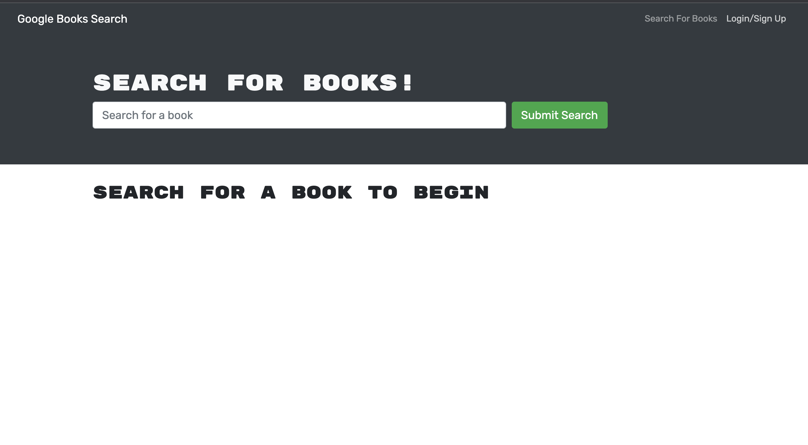

# Book-Search-Engine

## User Story
  
```
AS AN avid reader
I WANT to search for new books to read
SO THAT I can keep a list of books to purchase

```

## Description:
The application allows users to search books by keywords. Users can sign up and login to save their searchs.

## Screenshot


# Table of Contents
  
- [Description](#description)
- [Heroku Link](#Heroku)
- [Installation](#installation)
- [Usage](#usage)
- [Languages](#languages)
- [Contributing](#contributing)
- [Reference](#reference)
- [Questions](#questions)
  

## Installation:
    `npm init -y`

    `npm install @apollo/client @apollo/react-hooks apollo-boost graphql graphql-tag jwt-decode`
   
## Usage
  Run the following command at th root of your project and answer the prompted questions:<br />

  `npm start`


## Technologies
  - JavaScript
  - HTML/CSS
  - React
  - MERN Stack
  
## Contributing
  ChunYu Chang
## Reference
  1.Reference from:
  https://github.com/CamWills89/book-search-engine <br />
  2.Class Moudles <br />
  https://github.com/mr91217/deep-thoughts<br />
## Questions
 Contact me<br />

## Contact
GitHub: [mr91217](https://github.com/mr91217)<br />
<br />
Email: mr91217@gmail.com<br />
<br />